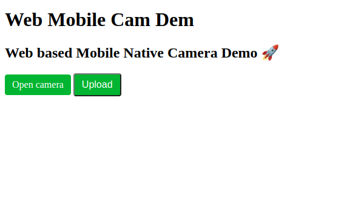

<div align="center">
  <h1>Web Mobile Cam Demo</h1>
  <p><h3 align="center">Upload Images through Web Using Mobile Native Camera Demo 🚀</h3></p>
</div>


<hr>





# 🚀 Usage

## Info
- uploaded images are saved in uploads/

## Install

```bash
pip install flask
```

## Run Dev Server

```bash
flask run --host=0.0.0.0
```


# 📝 Documentation

# 📚 References


# 🤝🏻 Connect with Me

[](https://github.com/HuzaifaIrfan/)
[](https://www.huzaifairfan.com)

# 📜 License

Licensed under the GPL3 License, Copyright 2025 Huzaifa Irfan. [LICENSE](LICENSE)
